

# My Dot-Files

Andreas Weyer  
\<<dev@cbaoth.de>\>  
version 1.0, 2018-08-01

Table of Contents

**JavaScript must be enabled in your browser to display the table of contents.**

## Summary

My core configuration (dot) files, shell functions and utility scripts.

### Repository Structure

    dotfiles/        Actual dotfiles symlinked to $HOME (zsh, bash, vim, X11, etc.)
    bin/             User utility scripts (added to PATH via ~/bin/)
    system-scripts/  System/admin scripts (some require root)
    lib/             Shared shell libraries (commons.sh)
    tools/           Repo tooling: link.sh, fix-modelines.py, etc.
    docs/            Documentation and TODO
    _archive/        Archived scripts pending review (not in PATH)

- ZSH is the leading shell.

- Bash configs exist for rare cases in which zsh is not available, they are not regularly maintained and usually outdated (consolidation is however a backlog topic).

- Portability is a core goal: the dotfiles/ + bin/ + lib/ + tools/link.sh approach is intentionally dependency-free and should work without additional packages or root access.

- Restricted-host support matters: basic setup should still be usable on systems with only bash available (no zsh, no extra tooling).

- If not clearly ZSH related, all alias, function, etc. files should be Bash compatible *(but not always POSIX compliant)*.

- All files use the " \\\\\\( .\*)?\$" *(or {{{ }}} in short)* folding comment pattern *(use e.g. [emacs](https://www.emacswiki.org/emacs/FoldingMode), [VS Code](https://marketplace.visualstudio.com/items?itemName=zokugun.explicit-folding), [eclipse](https://stackoverflow.com/a/6947590))*

<table>
<colgroup>
<col style="width: 50%" />
<col style="width: 50%" />
</colgroup>
<tbody>
<tr>
<td class="icon">

Note

</td>
<td class="content">See <a href="docs/TODO.md">docs/TODO.md</a> for the full task/improvement list.</td>
</tr>
</tbody>
</table>

### Dot-files

<table class="tableblock frame-all grid-all" style="
width:100%;
">
<colgroup>
<col style="width: 33%" />
<col style="width: 33%" />
<col style="width: 33%" />
</colgroup>
<tbody>
<tr>
<td class="tableblock halign-left valign-top">
File / Folder
</td>
<td class="tableblock halign-left valign-top">
App
</td>
<td class="tableblock halign-left valign-top">
Description
</td>
</tr>
<tr>
<td class="tableblock halign-left valign-top">
link:dotfiles/.zshenv[]
</td>
<td class="tableblock halign-left valign-top">
   <a href="https://en.wikipedia.org/wiki/Z_shell">ZSH</a>
</td>
<td class="tableblock halign-left valign-top">
Common ZSH login shell environment (variables).
</td>
</tr>
<tr>
<td class="tableblock halign-left valign-top">
link:dotfiles/.zlogout[]
</td>
<td class="tableblock halign-left valign-top">
   ZSH
</td>
<td class="tableblock halign-left valign-top">
Common ZSH logout cleanup
</td>
</tr>
<tr>
<td class="tableblock halign-left valign-top">
link:dotfiles/.zshrc[]
</td>
<td class="tableblock halign-left valign-top">
   ZSH
</td>
<td class="tableblock halign-left valign-top">
Common ZSH config
</td>
</tr>
<tr>
<td class="tableblock halign-left valign-top">
link:dotfiles/.zsh.d/zshrc-freebsd.zsh[] 
link:dotfiles/.zsh.d/zshrc-motoko.zsh[] 
link:dotfiles/.zsh.d/zshrc-puppet.zsh[] 
link:dotfiles/.zsh.d/zshrc-saito.zsh[] 
link:dotfiles/.zsh.d/zshrc-11001001_org.zsh[]
</td>
<td class="tableblock halign-left valign-top">
   ZSH
</td>
<td class="tableblock halign-left valign-top">
OS, distribution, and/or host specific ZSH configs.
</td>
</tr>
<tr>
<td class="tableblock halign-left valign-top">
link:dotfiles/.zsh.d/aliases.zsh[]
</td>
<td class="tableblock halign-left valign-top">
   SH
</td>
<td class="tableblock halign-left valign-top">
Common aliases
</td>
</tr>
<tr>
<td class="tableblock halign-left valign-top">
link:dotfiles/.zsh.d/aliases-freebsd.zsh[] 
link:dotfiles/.zsh.d/aliases-linux.zsh[] 
link:dotfiles/.zsh.d/aliases-linux_wsl.zsh[]
</td>
<td class="tableblock halign-left valign-top">
   SH
</td>
<td class="tableblock halign-left valign-top">
OS, distribution, and/or host specific aliases.
</td>
</tr>
<tr>
<td class="tableblock halign-left valign-top">
link:dotfiles/.zsh.d/functions/functions.zsh[]
</td>
<td class="tableblock halign-left valign-top">
   SH
</td>
<td class="tableblock halign-left valign-top">
Common shell functions.
</td>
</tr>
<tr>
<td class="tableblock halign-left valign-top">
link:dotfiles/.bashrc[]
</td>
<td class="tableblock halign-left valign-top">
   <a href="https://en.wikipedia.org/wiki/Bash_(Unix_shell)">Bash</a>
</td>
<td class="tableblock halign-left valign-top">
Common Bash config <em>(rarely maintained)</em>.
</td>
</tr>
<tr>
<td class="tableblock halign-left valign-top">
link:dotfiles/.xsession[]
</td>
<td class="tableblock halign-left valign-top">
   X, Wayland
</td>
<td class="tableblock halign-left valign-top">
Used by the display manager. Loads .profile and .xinitrc.
</td>
</tr>
<tr>
<td class="tableblock halign-left valign-top">
link:dotfiles/.xinitrc[]
</td>
<td class="tableblock halign-left valign-top">
   <a href="https://en.wikipedia.org/wiki/X_Window_System">X</a>, <a href="https://en.wikipedia.org/wiki/Wayland_(display_server_protocol)">Wayland</a>
</td>
<td class="tableblock halign-left valign-top">
Loaded from inside .xsession or when starting xinit.
</td>
</tr>
<tr>
<td class="tableblock halign-left valign-top">
link:dotfiles/.xsession.d/common[] 
link:dotfiles/.xsession.d/default[] 
link:dotfiles/.xsession.d/saito[]
</td>
<td class="tableblock halign-left valign-top">
   X, Wayland
</td>
<td class="tableblock halign-left valign-top">
Common, default and host specific xsession initialization scripts loaded from inside .xinitrc. The common script is always loaded, the host specific script .xsession.d/{hostname} is loaded if existing, else the fallback default is loaded.
</td>
</tr>
<tr>
<td class="tableblock halign-left valign-top">
link:dotfiles/.Xresources[] 
link:dotfiles/.Xresources.d/saito[]
</td>
<td class="tableblock halign-left valign-top">
   X, Wayland
</td>
<td class="tableblock halign-left valign-top">
Common and host specific <a href="https://en.wikipedia.org/wiki/X_resources">X Resources</a>. The .Xresources file is loaded from inside .xsession.d/common. If a host specific .Xresources.d/{hostname} exists, it is merged into the common resources.
</td>
</tr>
<tr>
<td class="tableblock halign-left valign-top">
link:dotfiles/.imwheelrc[]
</td>
<td class="tableblock halign-left valign-top">
   <a href="http://imwheel.sourceforge.net/">IMWheel</a>
</td>
<td class="tableblock halign-left valign-top">
General and app specific mouse button/wheel mappings.
</td>
</tr>
<tr>
<td class="tableblock halign-left valign-top">
link:dotfiles/.vimrc[]
</td>
<td class="tableblock halign-left valign-top">
   <a href="https://www.vim.org/">VIM</a>
</td>
<td class="tableblock halign-left valign-top">
VIM configuration
</td>
</tr>
<tr>
<td class="tableblock halign-left valign-top">
link:dotfiles/.config/mpv/config[] 
link:dotfiles/.config/mpv/input.conf[]
</td>
<td class="tableblock halign-left valign-top">
   <a href="https://en.wikipedia.org/wiki/Mpv_(media_player)">mpv</a>
</td>
<td class="tableblock halign-left valign-top">
MPV configuration and key bindings.
</td>
</tr>
<tr>
<td class="tableblock halign-left valign-top">
link:dotfiles/.mplayer/config[] 
link:dotfiles/.mplayer/input.conf[]
</td>
<td class="tableblock halign-left valign-top">
   <a href="https://en.wikipedia.org/wiki/MPlayer">MPlayer</a>
</td>
<td class="tableblock halign-left valign-top">
Old MPlayer configuration and key bindings (switched to mpv).
</td>
</tr>
</tbody>
</table>

#### Host / OS specific zsh files

Custom host / OS specific ZSH configurations, aliases, functions, xsessions and xresources can be created and they are dynamically loaded in case of a match. This provides a convenient way to enrich the environment in case of a specific host / os without messing around with the core files.

This is the sequence in which zshrc’s, aliases and functions are loaded from within .zshrc:

     # top of zshrc (always loaded)
     .zsh.d/functions.zsh
     .zsh.d/aliases.zsh

     # bottom of zshrc (loaded in given sequence if host/os matches)
     .zsh.d/functions-${OS}.zsh
     .zsh.d/functions-${HOST}.zsh
     .zsh.d/functions-${HOST}-${OS}.zsh
     .zsh.d/functions-${HOST}-${OS}_wsl.zsh

     .zsh.d/aliases-${OS}.zsh
     .zsh.d/aliases-${HOST}.zsh
     .zsh.d/aliases-${HOST}-${OS}.zsh
     .zsh.d/aliases-${HOST}-${OS}_wsl.zsh

     .zsh.d/zshrc-${OS}.zsh
     .zsh.d/zshrc-${HOST}.zsh
     .zsh.d/zshrc-${HOST}-${OS}.zsh
     .zsh.d/zshrc-${HOST}-${OS}_wsl.zsh

The special suffix \_wsl is used on [Windows Subsystem Linux](https://en.wikipedia.org/wiki/Windows_Subsystem_for_Linux), this allows the -linux files to be loaded in addition to (followed by) a WSL specific -linux_wsl file.

Some examples can be seen in the [\[Dot-files\]](#Dot-files) list above.

### User Scripts (bin/)

|  |  |
|----|----|
| File | Description |
| link:bin/media-keys\[\] | Script to be used from within X (e.g. media key mappings) for media player control (play/pause, prev/next song) and pulse audio volume control (+/-5% and toggle mute) optionally showing an OSD. |
| link:bin/apt-update\[\] | Quietly update apt package indexes and store a timestamp. |
| link:bin/exif-move-to-rating-dirs\[\] | Organize image files into a directory hierarchy based on EXIF star ratings (0-5) and color labels. Features smart caching, directory mapping with regex patterns, and move/copy modes. See link:bin/exif-move-to-rating-dirs.d/README.md\[\] for full documentation. |
| link:bin/smfetch\[\] | Fetch RTMP and direct HTTP media links from broadcaster pages using wget and rtmpdump. |
| link:bin/aria2c-d\[\] | aria2c downloader wrapper. |
| link:bin/diff-ini\[\] | Diff INI files. |
| link:bin/ff-copy\[\] | Firefox copy utility. |
| link:bin/ff-copy-mpv-bookmarks\[\] | Copy MPV bookmarks from Firefox. |
| link:bin/getbyext\[\] | Get files by extension from a given URL using wget. |
| link:bin/gif-cycle\[\] | GIF frame cycling utility. |
| link:bin/gif-delay\[\] | GIF frame delay inspector/modifier. |
| link:bin/git-fix-chmod\[\] | Fix Git file permissions (chmod). |
| link:bin/image-concat\[\] | Concatenate images. |
| link:bin/mpv-find\[\] | Find media files and play with mpv. |
| link:bin/netshare-bench\[\] | Benchmark mounted network shares (NFS/CIFS/SMB) using fio and iozone. Tests sequential/random I/O, parallel photo-app reads (Lightroom/XnView MP workload), directory traversal (readdir/getattr RPC load), and network latency. Useful for comparing protocols and configuration tuning (LAN vs. Wi-Fi, server/client settings). All output is logged to a timestamped file alongside stdout. |
| link:bin/rsync-parallel-backup\[\] | Parallel rsync backup. |
| link:bin/rsynclt\[\] | rsync with limited throughput. |
| link:bin/wget-p\[\] | Parallel file fetching wrapper for wget. |
| link:bin/while-read\[\] | Execute a command for each line read from stdin. |
| link:bin/xsuspend\[\] | Suspend the X session. |

### System / Admin Scripts (system-scripts/)

Scripts intended for system administrators or privileged operations (some require root).

|  |  |
|----|----|
| File | Description |
| link:system-scripts/backup\[\] | System backup script with exclusion list; supports full and incremental backups. |
| link:system-scripts/bedtime-shutdown/bedtime-shutdown.sh\[\] | Force system shutdown at a configured bedtime with grace periods, desktop notifications, and emergency overrides. See link:system-scripts/bedtime-shutdown/README.md\[\] for full documentation. |
| link:system-scripts/dbbackup\[\] | Backup script for MySQL and PostgreSQL databases. |
| link:system-scripts/fail2ban-summary-mail\[\] | Send a weekly Fail2Ban summary email from recent log data (intended for cron). |
| link:system-scripts/nextcloud-maintenance\[\] | Run routine Nextcloud maintenance tasks (DB indices, repair, integrity checks, app updates). Intended for cron with cronic. |
| link:system-scripts/openvpn-client-cfg\[\] | Generate OpenVPN client configuration bundles from server PKI assets; manage static IPs, CCD, and certificate revocation. |

### Repository Tooling (tools/)

|  |  |
|----|----|
| File | Description |
| link:tools/link.sh\[\] | Symlink all files in dotfiles/ to the user’s home directory. Missing directories are created in the process. Existing files that would be overwritten are moved to a backup location. |
| link:tools/permissions.sh\[\] | Update dotfile repo file permissions. |
| link:tools/fix-modelines.py\[\] | Normalize and deduplicate editor modelines (Emacs, Vim, VS Code, ShellCheck) across shell scripts. |
| link:tools/fix-style.sh\[\] | Apply style fixes to shell scripts. |
| README.md | This file. |

## Shell Functions

Some of the shell functions contained in link:.zsh.d/functions.zsh\[\] will be described in the following chapters.

### Print

<table class="tableblock frame-all grid-all" style="
width:100%;
">
<colgroup>
<col style="width: 50%" />
<col style="width: 50%" />
</colgroup>
<tbody>
<tr>
<td class="tableblock halign-left valign-top">
Function
</td>
<td class="tableblock halign-left valign-top">
Description
</td>
</tr>
<tr>
<td class="tableblock halign-left valign-top">
*p_usg* _USAGE.._
</td>
<td class="tableblock halign-left valign-top">
Print a <em>Usage</em> text. 
 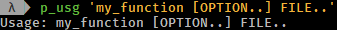 
</td>
</tr>
<tr>
<td class="tableblock halign-left valign-top">
*p_msg* _MSG.._
</td>
<td class="tableblock halign-left valign-top">
Print an info message. 
 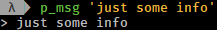 
</td>
</tr>
<tr>
<td class="tableblock halign-left valign-top">
*p_war* MSG..
</td>
<td class="tableblock halign-left valign-top">
Print a warning message. 
 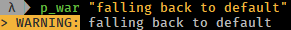 
</td>
</tr>
<tr>
<td class="tableblock halign-left valign-top">
*p_err* MSG..
</td>
<td class="tableblock halign-left valign-top">
Print an error message <em>(stderr)</em>. 
 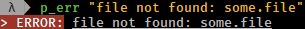 
</td>
</tr>
<tr>
<td class="tableblock halign-left valign-top">
*p_dbg* _DBG_LVL SHOW_AT_LVL MSG.._
</td>
<td class="tableblock halign-left valign-top">
Print a debug msg if the given debug level is reached. 
 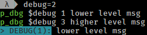  
A global debug level can be set via the DBG_LVL variable, in this case p_dbg will use the higher level max(arg-level, global-level), meaning whichever is larger. As a result the global level can be used to globally raise, but never to lower the locally used debug level. 
 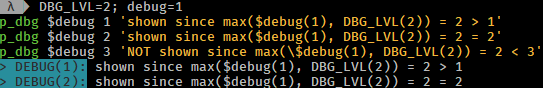  
So simply set the DBG_LVL argument to 0 if only the global level should be considered.  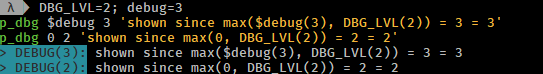  
 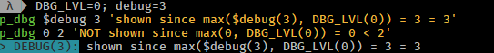  

</td>
</tr>
<tr>
<td class="tableblock halign-left valign-top">
*p_yes* 
*p_no*
</td>
<td class="tableblock halign-left valign-top">
Print <em>yes</em> in green and <em>no</em> in red color. 
 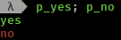 
</td>
</tr>
<tr>
<td class="tableblock halign-left valign-top">
*py_print* [-i import] PY_CODE..
</td>
<td class="tableblock halign-left valign-top">
Route the given code through the <em>python3</em> print function. 
   
Use -i to import additional packages. 
 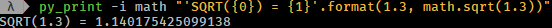 
</td>
</tr>
</tbody>
</table>

#### Colors

<table class="tableblock frame-all grid-all" style="
width:100%;
">
<colgroup>
<col style="width: 50%" />
<col style="width: 50%" />
</colgroup>
<tbody>
<tr>
<td class="tableblock halign-left valign-top">
Function
</td>
<td class="tableblock halign-left valign-top">
Description
</td>
</tr>
<tr>
<td class="tableblock halign-left valign-top">
*p_colortable*
</td>
<td class="tableblock halign-left valign-top">
Print 256 ansi color table. 
  
</td>
</tr>
<tr>
<td class="tableblock halign-left valign-top">
*tputs* _STYLE.._
</td>
<td class="tableblock halign-left valign-top">
Execute multiple tput commands in sequence. <em>Example:</em> 
 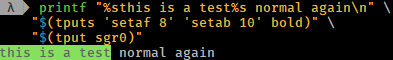 
</td>
</tr>
<tr>
<td class="tableblock halign-left valign-top">
*tp* _STYLE.._
</td>
<td class="tableblock halign-left valign-top">
Set one or more tput colors and text effects by (short) name. All values are looked up from a map <em>(no need to run an external process)</em>. 
 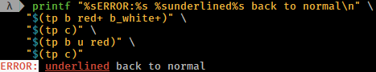 
</td>
</tr>
</tbody>
</table>

### Shell Functions

|  |  |
|----|----|
| Function | Description |
| \*func_name\* | Returns the current function’s name: \${FUNCNAME\[0\]} on bash, \${funcstack\[1\]} on zsh. |
| \*func_caller\* | Returns the function’s caller name *(if caller is a function)*: \${FUNCNAME\[1\]} on bash, \${funcstack\[2\]} on zsh. |

### Predicates

|  |  |
|----|----|
| Function | Description |
| \*is_zsh\* | true if zsh session, else: false |
| \*is_bash\* | true if bash session, else: false |
| \*is_su\* | true if root (super user) session, else: false |
| \*is_sudo\* | true if in sudo mode, else: false |
| \*is_sudo_cached\* | true if sudo has cached credentials, else: false |
| \*is_ssh\* | true if ssh session, else: false |
| \*is_int\* \_NUMBER..\_ | true if all given numbers are integers *(only digits)*, else: false. Ignores leading/trailing spaces, accepts leading +/- sign. |
| \*is_decimal\* \_NUMBER..\_ | true if all given numbers are decimals *(only digits, MUST contain decimal separator *.*)*, else: false. Ignores leading/trailing spaces, accepts leading +/- sign. |
| \*is_number\* \_NUMBER..\_ | true if all given numbers a either integers or decimals *(only digits, CAN contain decimal separator *.*)*, else: false. Ignores leading/trailing spaces, accepts leading +/- sign. |
| \*is_positive\* \_NUMBER..\_ | true if all numbers do *NOT* start with a -, else: false. Ignores leading/trailing spaces. *Note: This doesn’t check if the arguments are numbers (it simply checks for a leading -, should always be used in combination with is_int/decimal/number).* |

### Queries

|  |  |
|----|----|
| Function | Description |
| \*q_yesno\* \_QUESTION\_ | Print the QUESTION and asks for (y)es/(n)o input. Returns true if answer is yes, else: false. |
| \*q_overwrite\* \_FILE\_ | Checks if the given file exists, if so asks wether to overwrite it via (y)es/(n)o input. Returns true only if FILE exists AND if answer is yes, else: false. |

### Arrays

<table class="tableblock frame-all grid-all" style="
width:100%;
">
<colgroup>
<col style="width: 50%" />
<col style="width: 50%" />
</colgroup>
<tbody>
<tr>
<td class="tableblock halign-left valign-top">
Function
</td>
<td class="tableblock halign-left valign-top">
Description
</td>
</tr>
<tr>
<td class="tableblock halign-left valign-top">
*join_by* _DELIMITER ARRAY.._
</td>
<td class="tableblock halign-left valign-top">
Join array / arguments using the given delimiter. On ZSH consider using ${(j:del:)array}. 
 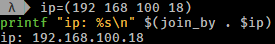  
Note that on zsh the same can be achived via ${(j:.:)ip}.  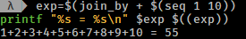 
</td>
</tr>
</tbody>
</table>

### Command

<table class="tableblock frame-all grid-all" style="
width:100%;
">
<colgroup>
<col style="width: 50%" />
<col style="width: 50%" />
</colgroup>
<tbody>
<tr>
<td class="tableblock halign-left valign-top">
Function
</td>
<td class="tableblock halign-left valign-top">
Description
</td>
</tr>
<tr>
<td class="tableblock halign-left valign-top">
*cmd_delay* _DELAY COMMAND.._
</td>
<td class="tableblock halign-left valign-top">
Execute a command with a delay (using sleep format, e.g. 3m for 3 minutes). <em>Sleep timer example:</em> cmd_delay 45m systemctl suspend.
</td>
</tr>
<tr>
<td class="tableblock halign-left valign-top">
*while_read* _COMMAND.._
</td>
<td class="tableblock halign-left valign-top">
Monitor input <em>(read lines)</em> and execute command in foreground using input as command argument. <em>Example: while_read wget to download all entered urls.</em>
</td>
</tr>
<tr>
<td class="tableblock halign-left valign-top">
*while_read_bg* _COMMAND.._
</td>
<td class="tableblock halign-left valign-top">
Monitor input <em>(read lines)</em> and execute command in background <em>(job)</em> using input as command argument. <em>Example: while_read_bg wget to download all entered urls.</em>
</td>
</tr>
<tr>
<td class="tableblock halign-left valign-top">
*while_read_xclip* [OPTION..] _COMMAND.._
</td>
<td class="tableblock halign-left valign-top">
Monitor X clipboard and execute command using clipboard content as command argument. <em>Example:</em> 
while_read_xclip -b -m '^https?://.*' tee -a links.txt "&lt;&lt;&lt;'{}'" | wget -nv -c -i - 
<em>to append all http(s) URLs read vom clipboard to a file named links.txt and download them using wget.</em>
</td>
</tr>
</tbody>
</table>

### Math

<table class="tableblock frame-all grid-all" style="
width:100%;
">
<colgroup>
<col style="width: 50%" />
<col style="width: 50%" />
</colgroup>
<tbody>
<tr>
<td class="tableblock halign-left valign-top">
Function
</td>
<td class="tableblock halign-left valign-top">
Description
</td>
</tr>
<tr>
<td class="tableblock halign-left valign-top">
*calc* _EXPR.._
</td>
<td class="tableblock halign-left valign-top">
A simple wrapper for dc. Set the decimal scale using the -s option (default: 0). 
 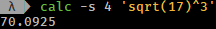 
</td>
</tr>
<tr>
<td class="tableblock halign-left valign-top">
*py_calc* _PY_CODE.._
</td>
<td class="tableblock halign-left valign-top">
Routes PY_CODE through python3’s print function with from math import *. 
   
Apart from this additional import it’s basically the same as py_print so this is also possible <em>(even without the math. prefix)</em>: 
 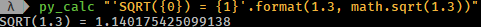 
</td>
</tr>
</tbody>
</table>

### Internet

<table class="tableblock frame-all grid-all" style="
width:100%;
">
<colgroup>
<col style="width: 50%" />
<col style="width: 50%" />
</colgroup>
<tbody>
<tr>
<td class="tableblock halign-left valign-top">
Function
</td>
<td class="tableblock halign-left valign-top">
Description
</td>
</tr>
<tr>
<td class="tableblock halign-left valign-top">
*ytp* _URL.._
</td>
<td class="tableblock halign-left valign-top">
Download media files using https://rg3.github.io/youtube-dl/[youtube-dl] and https://aria2.github.io/[aria2c] <em>(4 concurrent downloads, 4 threads per host)</em> using the same output file names provide by youtube-dl using the following pattern: %(title)s [%(id)s].%(ext)s. 
<em>Note that this is basically the same as the alias yt but using aria2c for parallel download instead of the integrated, single threaded downloader. When multiple formats are available, all yt* commands will favor free codecs starting with the highest quality streams _(rough codec/format priority: vp9/opus/vp8/vorbis/webm/ogg/*)</em>.
</td>
</tr>
<tr>
<td class="tableblock halign-left valign-top">
*ytap* _URL.._
</td>
<td class="tableblock halign-left valign-top">
The same as ytp above, but downloads audio stream only preferably to a ogg(opus/vorbis) file. <em>Note that this is basically the same as the alias yta but using aria2c for parallel download.</em>
</td>
</tr>
</tbody>
</table>

### Multimedia

|  |  |
|----|----|
| Function | Description |
| \*mpv_find\* \_DIR \[OPTION..\] \[-a MPV-ARG..\]\_ | Find any media file *(default: .avi,.mkv,.mp4,.webm, regex match can be changed)* and play them using https://mpv.io/\[mpv\]. Allows sorting, fs tree recursion, list-only *(stdout, no playback)*, *resuming* *(from a given index)*, and passing additional arguments to mpv. *Example: mpv_find -r -s -R -a --no-resume-playback will play all videos in the current, and all subfolders, in random order, ignoring mpv’s remsue-playback function.* |
| \*to_mp3\* \_INFILE \[BITRATE \[OUTFILE\]\]\_ | Convert the given INFILE to mp3 using https://www.ffmpeg.org/\[ffmpeg\] (INFILE may be any media file containing an audio stream processable by ffmpeg). A bitrate of 160k and default output file name {infilename}-audio.mp3 ise used if no specific options are provided. |
| \*to_opus\* \_\[-b BITRATE\] INFILE \[OPUSENC_ARG..\]\_ | Convert the given INFILE to opus using https://opus-codec.org\[opusenc\] (infile may be any media file containing audio readable by opusenc). If no arguments are provided it uses the default opusenc vbr bitrate of *"64kbps per mono stream, 96kbps per coupled pair". The output file is {infilename}.opus \_(currently not changeable)*. |
| \*ff_concat\* \_OUTFILE INFILE..\_ | Concatenates all INFILEs into OUTFILE using ffmpeg. |
| \*ff_crop\* \_INFILE CROP \[OUTFILE\]\_ | Crop INFILE video using the given ffmpeg crop format *(e.g. 640:352:0:64)* to the default outfil {infilename}\_CROP.{infileext}. Requires imagemagick’s identify. |

#### Images

<table class="tableblock frame-all grid-all" style="
width:100%;
">
<colgroup>
<col style="width: 50%" />
<col style="width: 50%" />
</colgroup>
<tbody>
<tr>
<td class="tableblock halign-left valign-top">
Function
</td>
<td class="tableblock halign-left valign-top">
Description
</td>
</tr>
<tr>
<td class="tableblock halign-left valign-top">
*gif_delay* _FILE_
</td>
<td class="tableblock halign-left valign-top">
Returns all frame indexes of a gif FILE with their respective delays (speed). It is optionally possible to only list the delays --delay-only or to print only the <em>(rounded)</em> average 1/100 sec delay --average of all frames. In the --help examples are provided on how to change the speed of a gif file using imagemagick’s https://www.imagemagick.org/script/convert.php[convert]. Requires imagemagick’s https://www.imagemagick.org/script/identify.php[identify].
</td>
</tr>
<tr>
<td class="tableblock halign-left valign-top">
*image_concat* _FILE.._
</td>
<td class="tableblock halign-left valign-top">
Concatenate images. 
<em>TODO: Needs further improvement.</em>
</td>
</tr>
<tr>
<td class="tableblock halign-left valign-top">
*image_dimensions* _FILE.._
</td>
<td class="tableblock halign-left valign-top">
Returns dimensions given images in format: {file-name}&amp;#124;{w}&amp;#124;{h}&amp;#124;{w}x{h}&amp;#124;{w*x}&amp;#124;{min(w,h)}&amp;#124;{max(w,h)} (width, height, pixels, shortest/longest edge, etc.). The delimiter &amp;#124; can be changed. Requires imagemagick’s identify.
</td>
</tr>
</tbody>
</table>

## Appendix

Icon pack by [Icons8](https://icons8.com/)

------------------------------------------------------------------------

Version 1.0  
Last updated 2026-05-31 17:23:05 CEST

